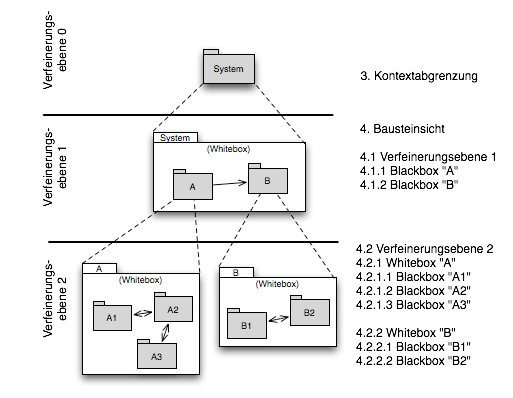

#Arc 42 Template

## 1. Einführung und Zielsetzung
(engl.: Introduction and Goals) Als Einführung in das Architekturdokument gehören hierher die treibenden Kräfte, die Software-Architekten bei Ihren Entscheidungen berücksichtigen müssen: Einerseits die Erfüllung bestimmter fachlicher Aufgabenstellungen der Stakeholder, darüber hinaus aber die Erfüllung oder Einhaltung der vorgegebenen Randbedingungen (required constraints) unter Berücksichtigung der Architekturziele.

### Aufgabenstellung
(engl.: Requirements Overview) Kurzbeschreibung der fachlichen Aufgabenstellung, Extrakt (oder Abstract) der Anforderungsdokumente. Verweis auf ausführliche Anforderungsdokumente (mit Versionsbezeichnungen und Ablageorten). Eine kompakte Zusammenfassung des fachlichen Umfelds des Systems. Beantwortet (etwa) folgende Fragen:

- Was geschieht im Umfeld des Systems?
- Warum soll es das System geben? Was macht das System wertvoll oder wichtig? Welche Probleme löst das System?

Aus Sicht der späteren Nutzer ist die Unterstützung einer fachlichen Aufgaben der eigentliche Beweggrund, ein neues (oder modifiziertes) System zu schaffen. Obwohl die Qualität der Architektur oft eher an der Erfüllung von nicht-funktionalen Anforderungen hängt, darf diese wesentliche Architekturtreiber nicht vernachlässigt werden. Kurze textuelle Beschreibung, eventuell in tabellarischer Use-Case Form. In jedem Fall sollte der fachliche Kontext Verweise auf die entsprechenden Anforderungsdokumente enthalten. Kurzbeschreibung der wichtigsten:

- Geschäftsprozessen,
- funktionalen Anforderungen,
- nichtfunktionalen Anforderungen und andere Randbedingungen (die wesentlichen müssen bereits als Architekturziele formuliert sein oder tauchen als Randbedingungen auf) oder
- Mengengerüste.
- Hintergründe Hier können Sie aus den Anforderungsdokumenten wiederverwenden - halten Sie diese Auszüge so knapp wie möglich und wägen Sie Lesbarkeit und Redundanzfreiheit gegeneinander ab.

### Qualitätsziele
(engl.: Quality Goals) Die Hitparade (Top-3 oder Top-5) der Architekturziele und/oder Randbedingungen, deren Erfüllung oder Einhaltung den maßgeblichen Stakeholdern besonders wichtig sind. Gemeint sind hier wirklich Architekturziele, nicht die Ziele des Projekts. Beachten Sie den Unterschied. Qualitätsziele könnten beispielsweise sein:

- Verfügbarkeit (availability)
- Änderbarkeit (modifiability)
- Performanz (performance)
- Sicherheit (security)
- Testbarkeit (testability)
- Bedienbarkeit (usability)

Wenn Sie als Architekt nicht wissen, woran Ihre Arbeit gemessen wird, können Sie während der Entwicklung kaum bestimmen, ob Ihre Lösung bereits gut genug ist oder nicht...

Mittel: Einfache tabellarische Darstellung, geordnet nach Prioritäten

Beginnen Sie NIEMALS mit einer Architekturentwicklung, wenn diese Ziele nicht schriftlich festgelegt und von den maßgeblichen Stakeholdern akzeptiert sind.

Quellen: Im DIN/ISO 9126 Standard finden Sie eine umfangreiche Sammlung möglicher Qualitätsziele. Für alle, die es nicht so genau wissen wollen: ein lesbarer Auszug davon ist im Buch "Agile Software- Entwicklung für Embedded Real-Time Systems mit der UML" (Hruschka, Rupp, Carl- Hanser-Verlag, 2002 auf Seite 9 zu finden.

Die Details zu diesem Abschnitt stehen in Kapitel 10 (Bewertungsszenarien).	

### Stakeholder
Eine Liste der wichtigsten Personen oder Organisationen, die von der Architektur betroffen sind oder zur Gestaltung beitragen können. Sie sollten die Projektbeteiligten und -betroffenen kennen, sonst erleben Sie später im Entwicklungsprozess Überraschungen. EInfache Tabelle mit Rollennamen, Personennamen, deren Kenntnisse, die für die Architektur relevant sind, deren Verfügbarkeit, etc. siehe z.B. VOLERE-Stakeholdertabelle.

## 2. Randbedingungen

(engl.: Architecture Constraints) Nach den Architekturtreiber im Kapitel 1 sollten Sie hier alle Fesseln festhalten, die Software-Architekten in ihren Freiheiten bezüglich des Entwurfs oder des Entwicklungsprozesses einschränken.

Architekten sollten klar wissen, wo Ihre Freiheitsgrade bezüglich Entwurfsentscheidungen liegen und wo sie Randbedingungen beachten müssen. Randbedingungen können vielleicht noch verhandelt werden, zunächst sind sie aber da.

Nutzen Sie informelle Listen, gegliedert nach den Unterpunkten dieses Kapitels.
Im Idealfall sind Randbedingungen durch die Anforderungen vorgegeben, spätestens die Architekten müssen sich dieser Randbedingungen bewusst sein. 

### Technische Randbedingungen
(engl.: Technical Constraints) Tragen Sie hier alle technischen Randbedingungen ein. Zu dieser Kategorie gehören Hard- und Software-Infrastruktur, eingesetzte Technologien (Betriebssysteme, Middleware, Datenbanken, Programmiersprachen, ...).

Beispiele:

- Hardware-Infrastruktur: Prozessoren, Speicher, Netzwerke, Firewalls und andere relevante Elemente der Hardware- Infrastruktur
- Software-Infrastruktur: Betriebssysteme, Datenbanksysteme, Middleware, Kommunikationssysteme, Transaktionsmonitor, Webserver, Verzeichnisdienste
- Systembetrieb: Batch- oder Onlinebetrieb des Systems oder notwendiger externer Systeme?
- Verfügbarkeit der Laufzeitumgebung:	Rechenzentrum mit 7x24h Betriebszeit? Gibt es Wartungs- oder Backupzeiten mit eingeschränkter Verfügbarkeit des Systems oder wichtiger Systemteile?
- Grafische Oberfläche: Existieren Vorgaben hinsichtlich grafischer Oberfläche (Style Guide)?
- Bibliotheken, Frameworks und Komponenten: Sollen bestimmte „Software-Fertigteile“ eingesetzt werden?
- Programmiersprachen: Objektorientierte, strukturierte, deklarative oder Regelsprachen, kompilierte oder interpretierte Sprachen?
- Referenzarchitekturen: Gibt es in der Organisation vergleichbare oder übertragbare Referenzprojekte?
- Analyse- und Entwurfsmethoden: Objektorientierte oder strukturierte Methoden?
- Datenstrukturen: Vorgaben für bestimmte Datenstrukturen, Schnittstellen zu bestehenden Datenbanken oder Dateien
- Programmierschnittstellen: Schnittstellen zu bestehenden Programmen
- Programmiervorgaben: Programmierkonventionen, fester Programmaufbau
- Technische Kommunikation: Synchron oder asynchron, Protokolle
- Betriebssystem und Middleware: Vorgegebene Betriebssysteme oder Middleware

### Organisatorische Randbedingungen
(engl.: Organizational Constraints) Tragen Sie hier alle organisatorischen, strukturellen und ressourcenbezogenen Randbedingungen ein. Zu dieser Kategorie gehören auch Standards, die Sie einhalten müssen, sowie juristische und gesetzliche Randbedingungen.

Mögliche Kategorien:

- Organisation und Struktur
- Ressourcen (Budget, Zeit, Personal)
- Organisatorische Standards
- Juristische und gesetzliche Faktoren

Beispiele für Organisation und Struktur

- Organisationsstruktur beim Auftraggeber: Droht Änderung von Verantwortlichkeiten? Änderung von Ansprechpartnern?
- Organisationsstruktur des Projektteams: mit/ohne Unterauftragnehmer, Entscheidungsbefugnis der Projektleiterin
- Entscheidungsträger: Erfahrung mit ähnlichen Projekten, Risiko-/Innovationsfreude
- Bestehende Partnerschaften oder Kooperationen:	Hat die Organisation bestehende Kooperationen mit bestimmten Softwareherstellern? Solche Partnerschaften geben oftmals Produktentscheidungen (unabhängig von Systemanforderungen) vor.
- Eigenentwicklung oder externe Vergabe: Selbst entwickeln oder an externe Dienstleister vergeben?
- Entwicklung als Produkt oder zur eigenen Nutzung? Dies bedingt andere Prozesse bei Anforderungsanalyse und Entscheidungen. Im Fall der Produktentwicklung: Neues Produkt für neuen Markt? Verbessertes Produkt für bestehenden Markt? Vermarktung eines bestehenden (eigenen) Systems? Entwicklung ausschließlich zur eigenen Nutzung?

Beispiele für Ressourcen (Budget, Zeit, Personal)

- Festpreisprojekt oder Abrechnung nach Zeit und Aufwand?
- Zeitplan: Wie flexibel ist der Zeitplan? Gibt es einen festen Endtermin? Welche Stakeholder bestimmen den Endtermin?
- Zeitplan und Funktionsumfang: Was ist höher priorisiert, der Termin oder der Funktionsumfang?
- Release-Plan: Zu welchen Zeitpunkten soll welcher Funktionsumfang in Releases/Versionen zur Verfügung stehen?
- Projektbudget: Fest oder variabel? In welcher Höhe verfügbar?
- Budget für technische Ressourcen: Kauf oder Miete von Entwicklungswerkzeugen (Hardware und Software)?
- Team: Anzahl der Mitarbeiter und deren Qualifikation, kontinuierliche Verfügbarkeit.

Beispiele für organisatorische Standards

- Vorgehensmodell: Vorgaben bezüglich Vorgehensmodell? Hierzu gehören auch interne Standards zu Modellierung, Dokumentation und Implementierung.
- Qualitätsstandards: Fällt die Organisation oder das System in den Geltungsbereich von Qualitätsnormen (wie ISO-9000)?
- Entwicklungswerkzeuge: Vorgaben bezüglich der Entwicklungswerkzeuge (etwa: CASE-Tool, Datenbank, Integrierte - Entwicklungsumgebung, Kommunikationssoftware, Middleware, Transaktionsmonitor).
- Konfigurations- und Versionsverwaltung: Vorgaben bezüglich Prozessen und Werkzeugen
- Testwerkzeuge und -prozesse: Vorgaben bezüglich Prozessen und Werkzeugen
- Abnahme- und Freigabeprozesse (für Datenmodellierung und Datenbankdesign, Benutzeroberflächen, Geschäftsprozesse/Workflows, Nutzung externer Systeme, etwa: schreibender Zugriff bei externen Datenbanken)
- Service Level Agreements: Gibt es Vorgaben oder Standards hinsichtlich Verfügbarkeiten oder einzuhaltender Service-Levels?

Beispiele für juristische Faktoren

- Haftungsfragen (Hat die Nutzung oder der Betrieb des Systems mögliche rechtliche Konsequenzen? Kann das System Auswirkung auf Menschenleben oder Gesundheit besitzen? Kann das System Auswirkungen auf Funktionsfähigkeit externer Systeme oder Unternehmen besitzen?)
- Datenschutz: Speichert oder bearbeitet das System „schutzwürdige“ Daten?
- Nachweispflichten: Bestehen für bestimmte Systemaspekte juristische Nachweispflichten? Hinsichtlich der SOX-Diskussion der letzten Jahre gewinnt dieser Punkt stetig an Bedeutung!
- Internationale Rechtsfragen: Wird das System international eingesetzt? Gelten in anderen Ländern eventuell andere juristische Rahmenbedingungen für den Einsatz (Beispiel: Nutzung von Verschlüsselungsverfahren)? 

### Konventionen
Fassen Sie unter dieser Überschrift alle Konventionen zusammen, die für die Entwicklung der Software-Architektur relevant sind.
Entweder die Konventionen als Kapitel hier direkt einhängen oder aber auf entsprechende Dokumente verweisen.

- Programmierrichtlinien
- Dokumentationsrichtlinien
- Richtlinien für Versions- und Konfigurationsmanagement
- Namenskonventionen

## 3. Kontextabgrenzung
(engl.: Scope of Product*)
Die Kontextabgrenzung grenzt das System oder das Produkt, für das Sie die Architektur entwickeln, von allen Nachbarsystemen ab. Sie legt damit die wesentlichen externen Schnittstellen fest.

Stellen Sie sicher, dass die Schnittstellen mit allen relevanten Aspekten (was wird übertragen, in welchem Format wird übertragen, welches Medium wird verwendet, ...) spezifiziert wird, auch wenn einige populäre Diagramme (wie z.B. das UML Use-Case Diagramm) nur ausgewählte Aspekte der Schnittstelle darstellen.

Die Festlegung der Schnittstellen zu Nachbarsystemen gehört zu den kritischsten Aspekten eines Projektes. Stellen Sie rechtzeitig sicher, dass Sie diese komplett verstanden haben.

Die folgenden Unterkapitel zeigen die logische und physische Einbettung Ihres Systems in seine Umgebung.

### Fachlicher Kontext
Hier werden alle Nachbarsysteme des betrachteten Systems festgelegt und alle fachlich-logischen Daten, die mit diesen ausgetauscht werden. Zusätzlich evtl. Datenformate und Protokolle der Kommunikation mit Nachbarsystemen und der Umwelt (falls diese nicht erst bei den spezifischen Bausteinen präzisiert wird.

Dieses Kapitel soll klar und unmissverständlich aufzeigen, welche (logischen) Informationen mit Nachbarsystemen (in welcher Form) ausgetauscht werden.

Wir sind an vielen Stellen im Dokument zu Pragmatismus bereit: hier jedoch bestehen wir auf der vollständigen Auflistung aller (a-l-l-e-r) Nachbarsysteme. Zu viele Projekte sind daran gescheitert, dass sie ihre Nachbarn nicht kannten :-(

Als Notation können Sie das gute, alte Kontextdiagramm aus der Strukturierten Analyse verwenden. Bei Nutzung von UML simulieren Sie dieses durch ein Klassendiagramm, ein Use Case Diagramme erweitert um die Ein-/Ausgaben oder ein Kommunikationsdiagramm - kurz durch irgendein Diagramm, das das System als Black Box darstellen und die Schnittstellen zu den Nachbarsystemen (mehr oder weniger ausführlich) beschreibt. Auch Tabellen aller Nachbarsysteme mit Erwähnung der jeweiligen Ein-/Ausgaben erfüllen den Zweck.

### Verteilungskontext
Hier legen Sie die physischen Kanäle zwischen Ihrem System und allen Nachbarsystemen fest, über die die logischen Ein-/Ausgaben von und zu Nachbarsystemen kommuniziert werden.
 
Das Kapitel soll aufzeigen, über welche Medien Informationen mit Nachbarsystemen bzw. der Umwelt ausgetauscht werden.
 
Als Form bietet sich z.B. ein UML Deploymentdiagramm mit den Kanälen zu Nachbarsystemen an. Sie ergänzen es um eine Mappingtabelle der logischen Ein-/Ausgaben aus Kapitel 3.1 auf die hier spezifizierten Kanäle.

## 4. Lösungsstrategie
(engl.: Solution Strategy)
Kurzer Überblick über Ihre grundlegenden Entscheidungen und Lösungsansätze, die jeder, der mit der Architektur zu tun hat, verstanden haben sollte.

**Motivation**

Dieses Kapitel motiviert übergreifend die zentralen Gestaltungskriterien für Ihre Architektur. Beschränken Sie sich hier auf das Wesentliche. Detailentscheidungen können immer noch bei den einzelnen Bausteinen oder im Kapitel 10 festgehalten werden. Das Kapitel soll Ihren Lesern die gewählte Strategie verdeutlichen.

**Form**

Fassen Sie (kurz!) die Beweggründe für zentrale Entwurfsentscheidungen zusammen. Motivieren Sie ausgehend von Aufgabenstellung, Qualitätszielen und Randbedingungen, was Sie entschieden haben und warum Sie so entschieden haben. Verweisen Sie – wo nötig - auf weitere Erklärungen, Konzepte, Strukturen oder Entscheidungen in Folgekapiteln.

## 5. Bausteinsicht
(engl.: Building Block View, short: Block View)
In diesem Hauptkapitel findet sich die statische Zerlegung Ihres Systems in Bausteine (Module, Komponenten, Subsysteme, Teilsysteme, Klassen, Interfaces, Pakete, Bibliotheken, Frameworks, Schichten, Partitionen, Tiers, Funktionen, Makros, Operationen, Datenstrukturen...) sowie deren Beziehungen untereinander.

Dies ist die wichtigste Sicht, die in jeder Architekturdokumentation vorhanden sein muss. Wenn Sie es mit dem Hausbau vergleichen ist das der Grundrissplan.

Die Bausteinsicht ist eine hierarchische Sammlung von Blackbox- und Whitebox- Beschreibungen (siehe Abbildung unten):

Das System als Black-Box (Ebene 0) haben wir bereits im Kapitel 3 gegen die Umgebung abgegrenzt. 

Die erste Ebene der Bausteinsicht ist somit der grafische Überblick über die Zerlegung des Systems als White-Box-Beschreibung des Gesamtsystems mit den zugehörigen Blackbox- Beschreibungen der Bausteine dieser Zerlegung.

Ebene 2 zoomt dann in die Bausteine der Ebene 1 hinein und ist somit die Sammlung aller White-Box- Beschreibungen der Bausteine der Ebene 1 zusammen mit den Black-Box-Beschreibungen der Bausteine der Ebene 2.

Die dritte Ebene 3 zoomt in alle interessanten Bausteine der Ebene 2 hinein, u.s.w.

In der Bausteinsicht verfeinern Sie jeweils als Whiteboxen die im Level zuvor beschriebenen Blackboxen. Eine Whitebox zeigt die innere Struktur einer Blackbox. Sie enthält mehrere Blackbox-Bausteine. Verwenden Sie zur 
Beschreibung das **White-Box-Template**, nachfolgend erläutern am Beispiel der Whitebox des Gesamtsystems.

### 5.1 Ebene 1: Whitebox-Beschreibung des Gesamtsystems
Nutzen Sie das unten stehende Whitebox-Template zur Beschreibung der obersten Ebene des Gesamtsystems.

---

*Whitebox-Template:*

- Ein **Übersichtsdiagramm** für die erste Ebene der Zerlegung des Gesamtsystems ein. Nutzen Sie als grafische Darstellung zum Beispiel UML-Komponentendiagramme, Paketdiagramme oder auch Klassendiagramme. Jede andere Form der Darstellung (Block- oder Kästchendiagramme) sind auch ok, sofern die grundsätzlichen Anforderungen an Architektursichten (Legende, Bedeutung von Diagrammelementen geklärt) erfüllt sind. Ergänzen Sie dieses Diagramm bei Bedarf um Begründungen, die zu dieser Struktur geführt haben, und um Verweise auf andere Sichten, die für das Verständnis auf dieser Abstraktionsebene relevant sind.
- Alle **neu geschaffenen Blackbox-Bausteine** (als Tabelle oder Liste mit Namen und eventuell einer Kurzbeschreibung). Deren innere Struktur wird in den nachfolgenden Verfeinerungsebenen dargestellt.
- **Lokale Beziehungen**: Als Tabelle oder Liste mit kurzen Beschreibungen der Abhängigkeiten oder (internen) Schnittstellen.
- **Entwurfsentscheidungen**: Gründe oder Entscheidungen, die zu dieser Struktur geführt haben.
- optional: **Verworfene Entwurfsalternativen** (mit Begründung!)
- optional: **Referenzen und weitere Info**: Dieser Abschnitt ist ein Platzhalter für weitere Informationen bezüglich dieser Whitebox.
- optional: **Offene Punkte**

In den Unterkapiteln folgen nun gemäß Blackbox-Templates (für jeden Baustein aus der hier beschriebenen Whitebox ein eigenes!) die Blackbox-Beschreibungen der hier eingeführten Bausteine.

#### 5.1.1 Blackbox-Beschreibung Baustein 1

*Blackbox-Template:*

- **Zweck / Verantwortlichkeit**: Hier beschreiben Sie aus der Sicht eines Nutzers oder Klienten dieses Bausteins, welche Aufgabe dieser Baustein übernimmt beziehungsweise welche Verantwortung er im Rahmen des Gesamtsystems wahrnimmt.
- **Schnittstelle(n)**: Hier beschreiben Sie, was der Baustein anderen liefert (Exportschnittstelle, provided-Interface) und was er von anderen Bausteinen benötigt (Importschnittstelle, required-Interface). Möglicherweise können Sie hier auf Schnittstellenklassen-/komponenten verweisen.
- **Erfüllte Anforderungen**: Fügen Sie hier bei Bedarf Verweise auf die Anforderungen ein, die der Baustein erfüllt.
- **Variabilität**: Hier beschreiben Sie, welche Veränderungen oder Flexibilität dieser Baustein zukünftig haben kann oder soll. Verwenden Sie diese Information als Basis für vorausschauenden Entwurf und zukunftssichere Schnittstellen.
- **Leistungsmerkmale**: Hier beschreiben Sie nichtfunktionale Eigenschaften des Bausteins, so genannte Qualities-of-Service (QoS). Beispiele hierfür sind möglicher Durchsatz, maximale & durchschnittliche Antwortzeiten, Einschränkungen bei Verfügbarkeiten (beispielsweise nur zu bestimmten Tages-/Nachtzeiten…).
- **Ablageort / Datei**: Fügen Sie hier einen Verweis ein, wo sich der Source-Code zu diesem Baustein befindet.
- **Sonstige Verwaltungsinformation**: Autor, Version, Datum, Änderungshistorie
- **Offene Punkte**: Notieren Sie alles, was für diesen Baustein noch geklärt werden muss. (Dieser Absatz ist hoffentlich bei einer stabilen Architektur leer.)

Anmerkung: Dieses Blackbox-Template ist Kernbestandteil der Architekturdokumentation! Kopieren Sie es für jede Blackbox auf jeder Beschreibungsebene!

#### 5.1.2 Blackbox-Beschreibung Baustein 2

...

#### 5.1.n. Blackbox-Beschreibung Baustein n

----

### 5.2 Ebene 2

In diesem Kapitel werden alle relevanten, verfeinerungswürdigen Bausteine der ersten Ebene zunächst - wenn nötig - als Whitebox beschrieben, jeweils gefolgt von den dadurch neu geschaffenen Blackboxen.

5.2.1 Whitebox-Beschreibung Baustein 1

5.2.1 Blackbox-Beschreibung Baustein 1.1

5.2.2 Blackbox-Beschreibung Baustein 1.2

...

#### 5.1.n. Blackbox-Beschreibung Baustein 1.n

5.1.1 Whitebox-Beschreibung Baustein 2

5.1.1 Blackbox-Beschreibung Baustein 2.1

5.1.2 Blackbox-Beschreibung Baustein 2.2

...

5.2.n. Blackbox-Beschreibung Baustein 2.n
. . . 

5.1.n Whitebox-Beschreibung Baustein n

5.1.1 Blackbox-Beschreibung Baustein n.1

5.1.2 Blackbox-Beschreibung Baustein n.2

...

5.1.m. Blackbox-Beschreibung Baustein n.m

## 6. Laufzeitsicht
(engl.: Runtime View)
Diese Sicht beschreibt, wie sich die Bausteine des Systems als Laufzeitelemente (Prozesse, Tasks, Activities, Threads, ...) verhalten und wie sie zusammenarbeiten.

Alternative Bezeichnungen:

- Dynamische Sichten
- Prozesssichten
- Ablaufsichten

Suchen Sie die aus Ihrer Sicht relevanten oder interessanten Laufzeitszenarien heraus, z.B.:

- Wie werden die wichtigsten Use-Cases durch die Architekturbausteine bearbeitet?
- Welche Instanzen von Architekturbausteinen gibt es zur Laufzeit und wie werden diese gestartet, überwacht und beendet?
- Wie arbeiten Systemkomponenten mit externen und vorhandenen Komponenten zusammen?
- Wie startet das System (etwa: notwendige Startskripte, Abhängigkeiten von externen Subsystemen, Datenbanken, Kommunikationssystemen etc.)?

Anmerkung: Kriterium für die Auswahl der möglichen Szenarien (d.h. Abläufe) des Systems ist deren Architekturrelevanz. Es geht nicht darum, möglichst viele Abläufe darzustellen, sondern eine angemessene Auswahl zu dokumentieren.

Kandidaten sind:

- Die wichtigsten 3-5 Anwendungsfälle
- Systemstart
- Das Verhalten an den wichtigsten externen Schnittstellen
- Das Verhalten in den wichtigsten Fehlerfällen
 
Sie müssen (insbesondere bei objektorientierten Architekturen) nicht nur die Bausteine mit ihren Schnittstellen spezifizieren, sondern auch, wie Instanzen von Bausteinen zur Laufzeit miteinander kommunizieren.

Dokumentieren Sie die ausgesuchten Laufzeitszenarien mit UML-Sequenz-, Aktivitäts-, oder Kommunikationsdiagrammen.
Mit Objektdiagrammen können Sie Schnappschüsse der existierenden Laufzeitobjekte darstellen und auch instanziierte Beziehungen. Die UML bietet dabei die Möglichkeit zwischen aktiven und passiven Objekten zu unterscheiden.
 

### 6.1 Laufzeitszenario 1

- Laufzeitdiagramm
- Erläuterung der Besonderheiten bei dem Zusammenspiel der Bausteininstanzen in diesem Diagramm

### 6.2 Laufzeitszenario 2

- Laufzeitdiagramm
- Erläuterung der Besonderheiten bei dem Zusammenspiel der Bausteininstanzen in diesem Diagramm

.....

### 6.n Laufzeitszenario n

- Laufzeitdiagramm
- Erläuterung der Besonderheiten bei dem Zusammenspiel der Bausteininstanzen in diesem Diagramm
